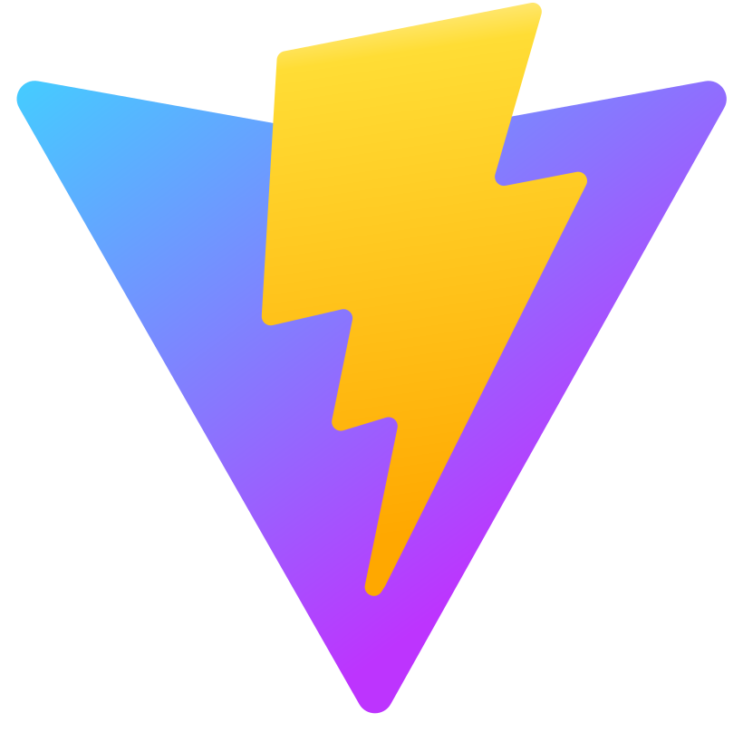

  
  
  <h1>Hey there, I'm Vitalii Zvieriev! </h1>

### About Me :

Fullstack Developer ( React.js | Node.js )

### My stack and tools :

<table align="center">
  <tr>
     <td align="center"  width="88">
       
        HTML5
     </td>
    <td align="center" width="88">
      
        CSS3
    </td>
    <td align="center" width="88">
     
      Sass
    </td>
    <td align="center" width="88">
      
       JavaScript
    </td>
    <td align="center" width="88">
      
       React.js
    </td>
     <td align="center" width="88">
        
       Redux
    </td>
   
  </tr>
    <td align="center" width="88">
        
       Vite
    </td>
     <td align="center" width="88">
      
       Node.js 
    </td>
    <td align="center" width="88">
        
       MongoDB
    </td>
    <td align="center" width="88">
      
       Postman
    </td>
    <td align="center" width="88">
      
       Git
    </td>
    <td align="center" width="88">
      
       VSCode
    </td>
</table>

### GitHub Stats :

  
 

  

 
 

 
 

